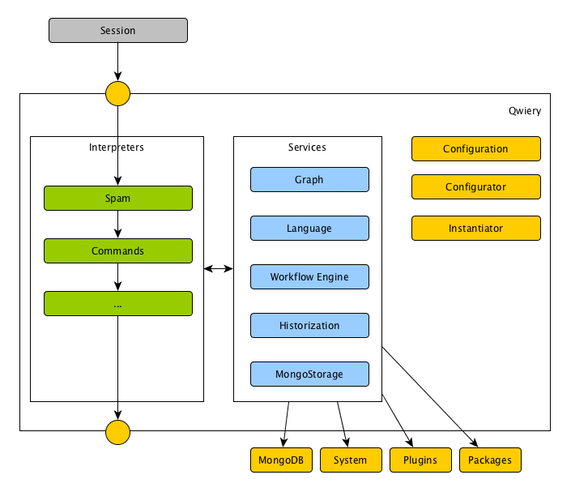

Qwiery is based on a simple idea: create a message pipeline where whatever instance listening to the pipeline wishes to transform or answer the data in the message can do so and opt to mark it as 'done'. If not marking it as done, the instance can still opt to do something with the message, i.e. create side-effects. A pipeline is something which is configured externally and assembled at startup. As such you can have multiple pipelines (apps) within one Qwiery instance. Also, since a message wraps everything about a request you can have simultaneous and parallel processing. 
 
 Some terminology in the context of this idea:
 
 - the pipeline consists or **interpreters** which can be assembled sequentially or in parallel. If parallel, it effectively means that they try simultaneously to answer the message.
 - the message is a **session**
 - any interpreter can consume a **service**. Every service is available to any interpreter.
 - when things are being assembled the **configuration** together with the **instantiator** are in charge of fetching plugins, creating instances, assigning members and so
 
 The whole idea is very similar to **dependency injection** or inversion of control but Qwiery isn't doing any injection, merely a modular recipe framework.
 
 To some extend almost everything is a plugin but there are some flavors:
 
 - services are global
 - interpreters attempt to deal with session
 - commands process direct instructions
 - storage plugins are storage-related (duh)
 
 Usually a service provides generic functionality while an associated interpreter calls the service. For example, the historization service can be called by any interpreter but it actually only makes sense to archive a session at the very end of the pipeline. So, there is an historization interpreter which does not attempt to answer a session but simply picks it up and lets the service store it in the backend.
 
 On the other hand, the language service is used anywhere and everywhere. Similarly the workflow service can be engaged anywhere to create flows on the fly. For example, whenever a confirmation is needed a temporary workflow is created which ensures that the user is (almost) forced to answer with yes or no. 
 
 Plugins are not limited to NodeJS. It's really easy to call Python or R (or whatever you favorite tech is) to integrate things. Also on the storage level, it's easy to replace the basic graph storage with more advanced stuff like [Neo4j](http://www.neo4j.com) or SQL Server (see for example [GraphDB.Net](http://www.graphdb.net)).
 
 