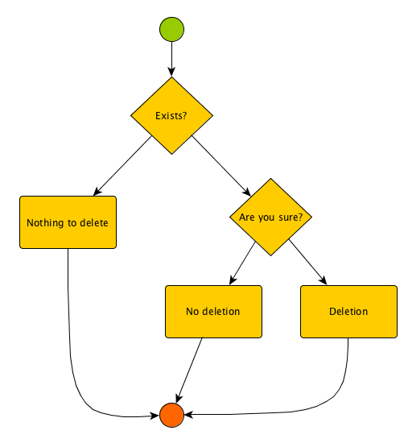

Imagine you need to ask confirmation or further specification from the user before performing an action. This happens, for example, by default in Qwiery when you use a command to delete a tag or an entity

    delete tag my_tag
    
In order to achieve this a little workflow is set up which temporarily kidnaps the default processing and holds the context:

        {
            "Name": "Confirm deletion of tag.",
            "SaveReminder": false,            
            "Variables": {
                "tagname": %1
            },
            "States": [
                {
                    name: "Exists",
                    type: "decision",
                    transition: "%{tagExists(variables.tagname)}",
                    initial: true
                },
                {
                    "type": "YesNo",
                    "name": "Confirmation",
                    "variable": "Username",
                    "enter": "Are you sure?",
                    "reject": "Use 'yes' or 'no' please."
                },

                {
                    "type": "QA",
                    "name": "Deletion",
                    "final": true,
                    "execute": {"%eval": "deleteTag(variables.tagname)"},
                    "enter": "Done."
                },
                {
                    name: "NotThere",
                    type: "dummy",
                    enter: "Nothing to delete, the tag does not exist",
                    final: true
                },
                {
                    "type": "QA",
                    "name": "NoDeletion",
                    "final": true,
                    "enter": "Nothing was deleted."
                }
            ],
            "Transitions": [
                "Confirmation->Deletion",
                "Confirmation->NoDeletion, false",
                "Exists->Confirmation", "Exists->NotThere, false"
                ]
        }
        

The logic is depicted in the diagram below. 

Like every workflow (state machine):

- you need a single initial state and one or more final states
- the flow has some parameters which can be accessed across the flow (the 'tagname' above)
- each state performs an actions and emits a message which ends up as a reply to the user
- the state types define how a state reacts to input
- the workflow has inline call which are being interpreted at runtime (e.g. '%eval: deleteTag' effectively deletes the tag when the state is executed)
- the user can use at any moment a quit-like input to terminate the flow and, hence tell Qwiery to forget altogether about the initial request to delete something
- the transitions are specified via the name of a state and the additional parameter specifies how a transition occurs. If none specified, 'true' is assumed. One can use arbitrary values here but the common states use booleans. If you define your own states you can use the values in any way you like to define custom flows and transitions.

The tagname given initially ends up in the '%1' slot. This can be seen from the question in the template

        "Template": {
                "Answer": "ThinkResult",
                "Think": {
                    "CreateReturn": {
                        "Workflow": ...(the flow defined above)...
                    }
                }
            },
            "Questions": [
                "delete tag %1"
            ]
        }
        
        