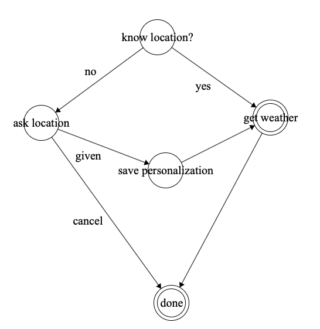

Workflows are a powerful way to handle interactions with a particular aim. They bundle a set of input-output towards the completion of a task. 

**Example**

If a user asks for the weather forecast Qwiery needs to know the location of the user. Either this location (a personalization feature) has been captured before or Qwiery needs to ask it explicitly. If asked it needs to somehow remember that the given answer is linked to the initial forecasting question. After this the actual forecast can be picked up from a weather service and returned. In order to achieve this coherence a workflow has to be defined which ensures that the necessary data is loaded or asked, save the intermediate state of the discussion and many other things.

Workflows sit in a QTL template and can be inserted as an answer. When a question hits a workflow Qwiery will instantiate things and the workflow engine will kick in. 

In order to write workflows it's crucial to understand the lifecycle of a workflow and how workflow states and workflow transitions function:

- at any point in time one and **only one state is active**. The flow activate a state by calling its `activate` method which allows the state to initialize itself.
- when the flow is triggered the active state will handle the input through the `execute` method. This method can decide to accept or reject to move to a next state: 

    - the state can decide to terminate its active state by calling the `accept` method. The parameter of this method is the value used to decide which transition occurs. As long as the state does not accept the flow remains in that state. 
    - If the state decides not to accept the input as a way to transition the state calls the `reject` method with as parameter the reason why it's rejecting transition

- if the state has accepted to lose its active state the workflow will first call the `deactivate` method and then perform the transition

- when the engine enters a flow it either picks up the active state (from a previous round) or looks for the unique initial state of the flow. The uniqueness of the initial state is checked during validation. Terminal states need not be unique.

- when a state has been activated after a transition it's saved for the next exchange. This effectively represents **a frozen state of a discussion**. The flow is saved as an active flow meaning that it has not reached a final state and the user has to either reach the terminal state or abort the whole flow. Aborting a flow can happen at any time by means of quit-like input (quit, forget about it, never mind...).
- each of the methods of a state (activate, execute, ...) raise an event picked up by the workflow engine and the data therein is used to return an answer to the user (caller). For example, when activating the initial state this will give the actual answer of the initial input. Subsequent interactions are all handled by the flow and no other plugin will interprete the input unless the flow is terminated or quit. Qwiery ensures that if there is an active flow of a user it will automatically be placed in front of any other plugin and thus hijack the natural interpreter flow or logic. 

Workflow definitions are just a bit of JSON. When a workflow is defined inside a QTL template it describes a flow. When a such a flow has been instantiated it contains data from the interactions. So, a saved (serialized) flow contains both structure, logic and data. 
